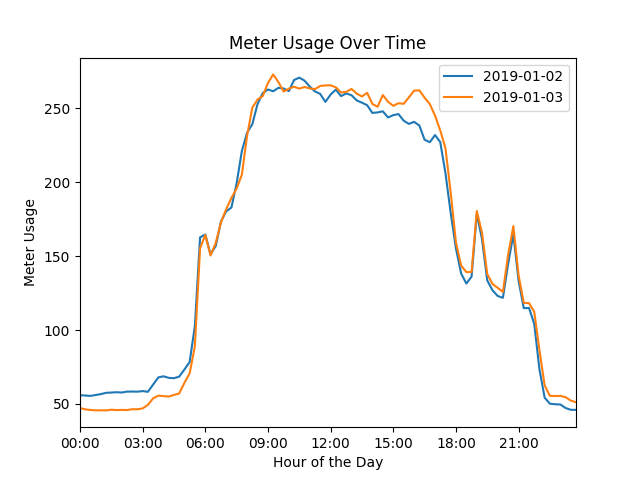

# Spectral Meter Usage

This repository contains the setup and creation instructions for the gRPC and Flask server based app to get meter usage data

## Setup

Create a new directory on your computer and set up anf actiavte a python3 virtual environment. 

```bash
virtualenv env
```
```bash
source env/bin/activate 
```
Clone this github repository and download the required libraries
```bash
pip3 install -r requirements.txt
```

## Usage

To use the app, you have to start two servers on two different bash terminals, remember to activate the virtual environment on both

1. gRPC server - accessing the data from the csv file

```bash
python3 gRPC_server.py
```

2. Flask server - returning the data to you on your browser

```bash
python3 flask_server.py
```

Go to your browser and enter the address for your flask app, set to ```localhost:5000```

Fill out the form for the dates you want, press submit, and voila!

### Example Graph

An example of the graph returned is as follows:



If you fill out the form with a date range for which we have no data, the flask server will return an empty dictionary as well as a 404 error. If part of the date range specified is in the database, the graph will show the data for those specific days

## Testing
I used the python unittest module to test my Flask routes. The following command on your terminal will run the tests in python (make sure your gRPC server is running in the background)

```bash
python3 tests.py
```
I also used the python coverage module to check the coverage of my tests on the flask app. Run the following command on your bash terminal to see the coverage 

```bash
coverage report -m
```

The app is currently at 98% total coverage


## Resources and Blockers
I used the following [link](https://www.semantics3.com/blog/a-simplified-guide-to-grpc-in-python-6c4e25f0c506/) to set up my basic gRPC server, and modified the functions as needed from there. My main blocker here was formatting my gRPC response to a dictionary or list. I had to settle with returning a string of the meter usage values by date and time, which I then convert back into a dictionary of datetime objects on my flask server.