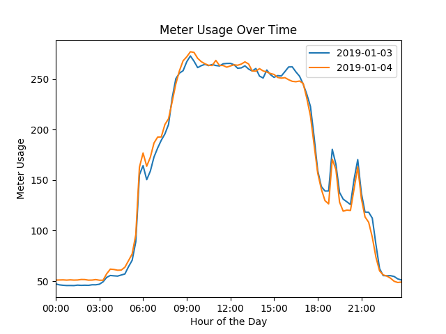
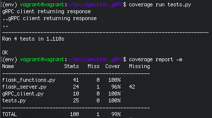

# Spectral Meter Usage App

This repository contains the setup and usage instructions for the gRPC and Flask based app to get meter usage data, as well as a description about my process, blockers and the resources I used to create it.

## Setup

Create a new directory on your computer, then set up and activate a python3 virtual environment, clone the repository, and download required libraries.

```bash
virtualenv env
source env/bin/activate 
git clone https://github.com/avarnajain/spectral_meterusage.git
pip3 install -r requirements.txt
```

## Usage

To use the app, you have to start two servers on two different bash terminals, remember to activate the virtual environment on both.

```bash
python3 gRPC_server.py
python3 flask_server.py
```

Go to your browser and enter the address for your flask app, set to ```localhost:5000```

Fill out the form for the dates you want, press submit, and voila!

An example of the graph returned is as follows:



## Resources and Blockers

gRPC Server + csv

Using the gRPC server was the most time consuming part of this prompt for me. After a fair bit of reading, I decided to follow the steps provided in the following [tutorial](https://www.semantics3.com/blog/a-simplified-guide-to-grpc-in-python-6c4e25f0c506/) to set up my gRPC server. Following the same steps, I modified the functions as needed for the prompt, starting with a single input function that queried the csv file, and then moving onto the two input (start and end date) function. My main blocker with the gRPC server was formatting my response to be a dictionary or a list. I had to settle with returning a string version of the meter usage values, which I then convert back into a dictionary of datetime objects on my flask server. Since I have worked with csv files before, I used the same csv library I am familiar with to open and read the data provided. 

Flask Server + HTML

I set up a flask server with a form on the homepage with start and end date as the input values. Since the data given to me was for one month only, I thought it might be more interesting to see patterns in meter usage over the course of a day, which I showcase in the output line graph. This can easily be changed based on the use case for the app. I did not spend much time on the front-end portion of the app in relation to the formatting of the HTML file.

Plotting

I have some previous experience using ggplot on R, but none using pandas, so I took some time to read through the types of ways to join dataframes in order to create the line plot. I settled with using the merge function, which I was only able to implement using a for loop and two data frames at a time, instead of a list of dataframes. Once the final df was created, I plot the figure and add some detail on the axes and title. 

Everytime a plot is created, it is stored in the static folder with a name based on the time the plot was created, making each plot unique to prevent caching on the browser. 

Testing

To test my flask app, I decided to use the python unittest module. To run the tests, you have to first run the gRPC_server locally on a different terminal. I wrote 4 different tests for the app - 
1. To check that the homepage renders the form itself
2. To check that a plot is returned on the successful submission of the form
3. To check that a 404 error is returned when the form is submitted with dates for which we have no data
4. To check that a 404 error is returned when the form is submitted with invalid dates

I also used the python coverage module to check my test coverage. The app is currently at 98% total coverage.


